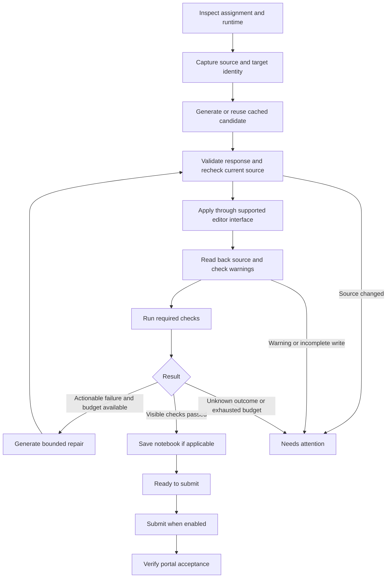

# Assignment automation plan: coding editors and Jupyter

Status: this is the original design record. The complete coding/notebook runner, submission tracking and assignment batch queue are now implemented. See [current behavior, setup and validation limits](ASSIGNMENTS.md) for the source of truth; earlier rollout gates below describe the original plan, not current feature switches.

## 1. What is verified, and what remains open

| Area | Observed or reported | Still to verify |
| --- | --- | --- |
| Standard coding | `/playground/code/<id>`; MIPS Mars 4.5; Verilog Icarus 13.0; Monaco 0.52.0; question, constraints, examples and starter source; separate Run/Submit and input/output/error areas | Python runtime labels, editable boundaries, live model access, source persistence, fresh run results and acceptance states |
| Notebook | `/playground/newton-box/<id>`; embedded `*.edison-jupyter.newtonschool.co` classic Jupyter notebook; Python 3; existing cells and unfinished code; Run and Save/Checkpoint inside the frame; Submit Solution outside | Notebook version/model access, stable cell identity, kernel session identity, save acknowledgement and grading feedback |
| Paste warning | User reports that pasting a large code block triggers a popup in normal coding editors; this has not occurred in Jupyter in their experience | Exact wording, trigger conditions and size threshold, whether it blocks insertion, whether it records a warning, and which editing methods the portal supports |

The normal coding page also contains input and expected-output editors. Selecting the first editor would be unsafe. The observed MIPS metadata/history request paths do not establish Run or Submit contracts. We will validate those through the portal's normal flow before relying on them.

## 2. Resolve the normal coding editor's paste popup before live insertion

The user reports this popup when pasting a large code block in normal coding editors. We have not reproduced it or inspected its wording. A formatting confirmation, clipboard permission prompt and integrity restriction need different handling, so the first coding-editor milestone is to classify it.

Notebook support can proceed independently of this coding-editor investigation. Jupyter's cell-editing flow still needs its own write, readback and save validation; the absence of a reported popup does not establish those behaviors.

1. Record the warning text and the action that caused it. Check whether the code was inserted, whether the page is blocked and whether a warning counter changed.
2. Confirm the portal-supported editing path for that workspace. Library APIs alone do not establish what the host application permits.
3. If supported, use an editor integration that preserves the source model, change notifications and undo history. Verify this on a local fixture before live validation.
4. Watch for relevant visible dialogs/banners before and after an edit. An unresolved warning moves the job to **Needs attention**, with no subsequent Run or Submit.
5. If the portal restricts automated insertion, retain **Generate and Preview** until a permitted insertion route is available.

The plan does not depend on suppressing a warning, removing monitoring, imitating human typing or silently replacing a blocked paste with direct model mutation. A different insertion method cannot guarantee that the portal records no event.

Monaco documents model/value access and edits that participate in undo history. These are candidate integration capabilities; compatibility with Newton's loaded version and warning behavior must be verified. [Monaco editor API](https://microsoft.github.io/monaco-editor/typedoc/interfaces/editor_editor_api.editor.ICodeEditor.html)

## 3. Architecture

Use one assignment job runner with two adapters. The runner owns scheduling, budgets, cancellation, repair counts and progress. Adapters own workspace-specific reading, editing and execution.

An assignment retains separate states for generated, applied, run completed, checks passed, saved, submitted and accepted. Public samples passing is not proof of hidden-test acceptance.

### Proposed components

Paths below are planned additions, not existing implementation.

| Component | Responsibility |
| --- | --- |
| `extension/src/modules/assignments/assignmentDetector.js` | Detect workspace, problem identity, supported runtime and notebook frame |
| `extension/src/modules/assignments/codeAdapter.js` | Map source/input/result editor roles; read, apply and verify source; run and collect results |
| `extension/src/modules/assignments/notebookAdapter.js` | Read cells and kernel state; apply guarded replacements; execute dependencies; verify saving |
| `extension/src/modules/assignments/assignmentRunner.js` | Shared job state, stale-source checks, repair limits, warning handling and cancellation |
| `extension/src/modules/assignments/AssignmentDashboard.jsx` | Inspect, Generate, Apply, Test, Stop, Restore and submission settings |
| `backend/routes/assignmentRoutes.js` | Generation jobs, status and cancellation |
| `backend/services/assignmentService.js` | Context construction, response validation, runtime requirements, usage ledger and candidate cache |

Reuse `groqClient.js` and `solutionCache.js`. Preserve the existing MCQ/numeric API. Extend the background busy guard so quiz and assignment writes cannot overlap, including actions started from the popup.

The backend generates code; execution uses the inspected portal runtime. Generated assignment code will not run inside the local Express process.

## 4. Standard coding: language-aware workflow

### A. Capture the task

Read the full statement, constraints, input/output format, examples, selected runtime and complete starter source. Preserve indentation and line breaks. Capture every required instruction on the left, including signatures and comments in the starter.

Store the problem ID, URL, document identity, actual source model/file identity, language/runtime and original source hash. Identify code, stdin, output, error and expected-output areas independently. If multiple source files are required, enumerate their actual editable targets before generation; do not pretend a one-file adapter supports an uninspected project workspace.

### B. Preserve the runtime's requirements

| Runtime family | Required context and checks |
| --- | --- |
| Python | Actual Python version; full script versus function-only task; imports, required function/class signature, stdin parsing and exact output format |
| MIPS | Observed Mars 4.5 dialect; starter sections and labels; entry point; permitted instructions and syscall behavior required by the task |
| Verilog | Actual Verilog/SystemVerilog dialect and simulator; top module, port names, widths and signedness; clock/reset behavior; supplied testbench and editable boundaries |
| Other languages | Detected portal runtime plus a tested profile for its entry point, compilation mode and harness. Show unsupported status when these cannot be established |

Keep the selected language by default. Syntax highlighting is not enough to determine the compiler. Language support is enabled after its profile passes fixtures and a representative live check; it is not inferred from Monaco alone.

### C. Generate a candidate

Send compact task context to a separate coding endpoint. A proposed request contains:

- Job ID, workspace kind, problem content and runtime profile.
- Relevant sources with target IDs and source hashes.
- Editable boundaries, required signatures and starter/harness constraints.
- Examples and optional feedback from the current failed run.
- Model, output budget and prompt/schema version.

The response contains structured edits: `{ targetId, baseSourceHash, content }`, plus a short explanation and stated assumptions. It cannot introduce arbitrary file paths, editor targets or execution commands. For one source editor, one complete replacement is simpler to validate than an unconstrained patch. Protected starter sections must remain intact.

Reject incomplete JSON, duplicate/unknown targets, wrong runtime, missing content and a provider response marked as truncated. Structural validation is followed by portal compilation/tests; it does not establish program correctness.

### D. Apply and run

Immediately before applying, compare the live problem, runtime, model and source with the captured snapshot. Preserve manual edits by stopping on a mismatch. Save an original-source backup, apply through the supported integration, then read back the exact result.

Run only after source readback and warning checks succeed. Use the task's public examples or an explicit test input; do not mistake the expected-output tool for the source editor or grader. Match results to the current source hash and a new execution identifier or verified run transition.

Classify fresh results as compilation error, runtime error, timeout, wrong output, checks passed, or unknown outcome. Comparison must follow the assignment's rules; do not invent numerical tolerances or normalize away meaningful output differences.

### E. Repair and submission

Repairs receive the current candidate and relevant new diagnostics. Fix syntax, runtime and algorithm errors differently. Stop if the same candidate/failure repeats or feedback is insufficient.

Initial release ends at **Ready to submit**. Add optional auto-submit after accepted/rejected/pending states are verified. Before submission, confirm the same problem, runtime and tested source remain active. If a submission result is lost, inspect status/history before allowing another submission.

## 5. Jupyter: operate on cells and kernel state

### A. Discover and snapshot

Identify the notebook frame belonging to the current assignment, then read the notebook model if a supported integration exposes it. Record notebook identity, kernel language/session, ordered cells, cell types, exact source, editable metadata and relevant output summaries. If only part of the notebook is available, report incomplete coverage rather than silently generating from missing context.

The notebook format stores source, metadata, execution counts and outputs separately; newer notebook schemas include cell IDs. Preserve the observed structure and use cell IDs where available. Otherwise require a matching position, type and source hash, stopping when the ordering changes. [Notebook format](https://nbformat.readthedocs.io/en/latest/format_description.html)

Use narrowly targeted frame/document operations after discovery. Chrome supports injection into selected frames; access to Newton's frame and editor model still needs a live check. [Chrome scripting API](https://developer.chrome.com/docs/extensions/reference/api/scripting)

### B. Select edits and dependencies

Classify cells as instructions, environment setup, imports, data preparation, definitions, training, evaluation or tests. A `pass` or empty cell alone is not sufficient to decide that it should be replaced; use the assignment and surrounding code.

Capture the cells that must change and the supporting dependencies needed to understand them. If the relevant context exceeds the budget, divide work at a coherent dependency boundary or stop for review; never silently drop required cells. Generate replacements only for declared editable targets. Preserve markdown, grader/test cells, metadata and unrelated source.

Before any write, recheck both target cells and the dependency context used for generation. Preflight all replacements, then verify each applied cell. If application stops partway, record exactly what changed. Restore a cell only if its current source still matches SolverAI's applied version, so restoration cannot overwrite a later manual edit.

### C. Execute in a controlled order

Use the current kernel session and tracked source versions to determine what must run. Re-execute changed definitions and affected dependent checks. Reuse setup/data only when evidence supports that the required state remains valid in the same kernel.

Do not reinstall packages, download datasets or restart full training after every repair. Kernel restart invalidates the execution ledger. When state is uncertain, present the required setup/dependency run rather than assume that an old execution count proves readiness. Long training needs a separate visible time budget from short checks.

Track fresh results per execution. Where a supported integration exposes Jupyter execution messages, match the request ID to its replies/outputs and completion state. Otherwise verify the cell's new execution transition and outputs through the UI. Global kernel idle alone is insufficient evidence. [Jupyter messaging](https://jupyter-client.readthedocs.io/en/latest/messaging.html)

A timed-out wait has an unknown outcome until the kernel's state is reconciled. It must not automatically trigger another run of the same cell. Repair only from relevant tracebacks, test failures or other fresh diagnostics.

### D. Save and finish

Verify required checks, then save through the notebook's supported control and observe acknowledgement. Track dirty state separately from completed execution. Only then prepare the outer **Submit Solution** step, once its required save/submission relationship has been validated.

The final report states which cells changed, what executed, what checks passed, whether saving completed and whether the portal accepted a submission. Cell completion alone does not mark the assignment solved.

## 6. Free-key limits

Suggested initial defaults, to tune against the configured model and observed usage:

| Limit | Proposed value/behavior |
| --- | --- |
| Concurrent assignment jobs | One active job; share the provider queue with quizzes |
| Logical generations | One initial generation plus at most two repairs/continuations |
| Actual provider attempts | Six total per job, including 429 retries and format/truncation retries |
| Initial completion ceiling | Up to 2,048 tokens for a single program; up to 4,096 for a bounded notebook edit; clipped to model/account constraints |
| Further spending | Every additional request consumes the same job-wide attempt and configured token budget |
| Cache | Existing 15-minute/200-entry defaults, plus a byte limit because code responses are larger |
| Result polling | No LLM requests to check whether portal execution has finished |

Current `groqClient` allows an initial request plus three 429 retries. Without a shared job budget, three logical generations could therefore make twelve provider attempts. Add a ledger at the actual dispatch point; checking only the number of repairs is insufficient.

Keep coding model/reasoning settings separate from MCQ Turbo. Request compact structured code edits with brief explanations. Estimate prompt size and reserve output capacity before dispatch; reduce context only at a valid task boundary. Respect any configured model/account token limits and actual provider cooldowns; local estimates cannot establish the account's remaining quota.

Include credential hash, model, runtime, task, exact relevant source, targets, generation settings, prompt/schema version and repair feedback in the candidate cache key. Deduplicate identical pending generations. Cache valid complete candidates, never provider errors or truncated code. A cache hit still needs fresh source checks and execution.

Keep reported usage separate from estimates. Unknown usage on a failed request does not mean zero tokens. Stop on authentication errors, exhausted limits or a provider cooldown beyond the job's wait policy. Switching keys is not a quota strategy. Cancellation removes queued work before dispatch where possible; an already-sent request may still consume usage.

## 7. Job recovery and controls

Persist a small checkpoint containing job ID, phase, target document/frame, problem/runtime, original/applied source hashes, original-source backups, proposed edits, execution identity, warning text and usage counters. Do not copy credentials into job records. Set bounds and expiry for retained sources and drafts; the short-lived backend cache is not durable draft storage.

Chrome service-worker globals are lost on shutdown, so the current in-memory quiz pattern needs durable checkpoints for longer assignment work. [Chrome worker lifecycle](https://developer.chrome.com/docs/extensions/develop/concepts/service-workers/lifecycle)

On recovery, reconcile live source and execution state before resuming. Matching applied source means Apply may already be complete; matching original source leaves a retained valid draft ready. An expired or missing draft is marked as requiring regeneration, and another source value is a conflict. Unknown Run/Submit outcomes are checked, not blindly replayed. Use job/request IDs to deduplicate retries while the backend retains a job; after backend restart, reconcile or stop rather than assume deduplication survived.

Stop prevents all future edits, runs and submissions. It reports separately whether portal execution is still active. Interrupt is a distinct operation, used only for a current execution owned by this job through a verified portal control.

Proposed UI: **Inspect**, **Generate**, **Preview changes**, **Apply**, **Run checks**, **Automate to ready**, **Stop**, and **Restore original**. Auto-submit starts off. Show runtime, changed targets, phase, requests/tokens used, repair count, warning text and actual test outcome. Once an adapter is validated, normal steps can run together without a confirmation between every step.

## 8. Build order and acceptance criteria

| Milestone | Deliverable | Exit check |
| --- | --- | --- |
| 1. Discovery and popup diagnosis | Verify Python/Verilog examples, Monaco target mapping, notebook identity and warning behavior | Complete source/context captured; insertion policy understood; unsupported cases are explicit |
| 2. Shared jobs and generation backend | Assignment contract, structured edits, truncation validation, quota ledger, caching, persistent drafts/checkpoints, busy lock, Stop and restart reconciliation | Mocked responses cannot apply unknown targets, incomplete code or exceed dispatch budgets; interrupted jobs recover before any live writes are enabled |
| 3. Coding apply and testing | Source adapter, readback, Run/results, repair loop | Representative Python, MIPS and Verilog tasks preserve their required interface and produce correctly attributed fresh results |
| 4. Notebook apply and execution | Cell edits, dependency runs, kernel tracking and save checks | Multiple stubs handled without changing protected cells or unnecessarily replaying setup/training |
| 5. Completion and optional submission | Submission result tracking and full recovery/restore validation | Reopening the popup or restarting the worker cannot duplicate Apply, Run or Submit |
| 6. Broader rollout | Additional runtime profiles and optional catalog iteration | Each enabled profile passes fixtures and representative live validation |

Regression coverage includes existing quiz tests; multiple source/input/output editors; language switches; manual edits during API waits; popup appearance; new/removed/reordered cells; exact whitespace preservation; partial application; kernel restart; old successful output; save failure; cancellation at each boundary; worker restart during Apply/Run/Submit; unknown network outcomes; 429s; truncated generation; and exhausted repair budgets.

Build and test against local fixtures first. Live checks must establish the actual portal transitions; passing a mock alone does not prove that insertion, execution, saving or submission works on Newton.

## Immediate next step

Validate the implemented notebook adapter on a representative live notebook. Inspect the normal coding editor's large-paste warning wording and behavior, verify a Python problem, and establish the coding insertion/Run contracts before enabling those capabilities. Verilog inspection confirmed Icarus 13.0; automatic submission remains a later milestone.
